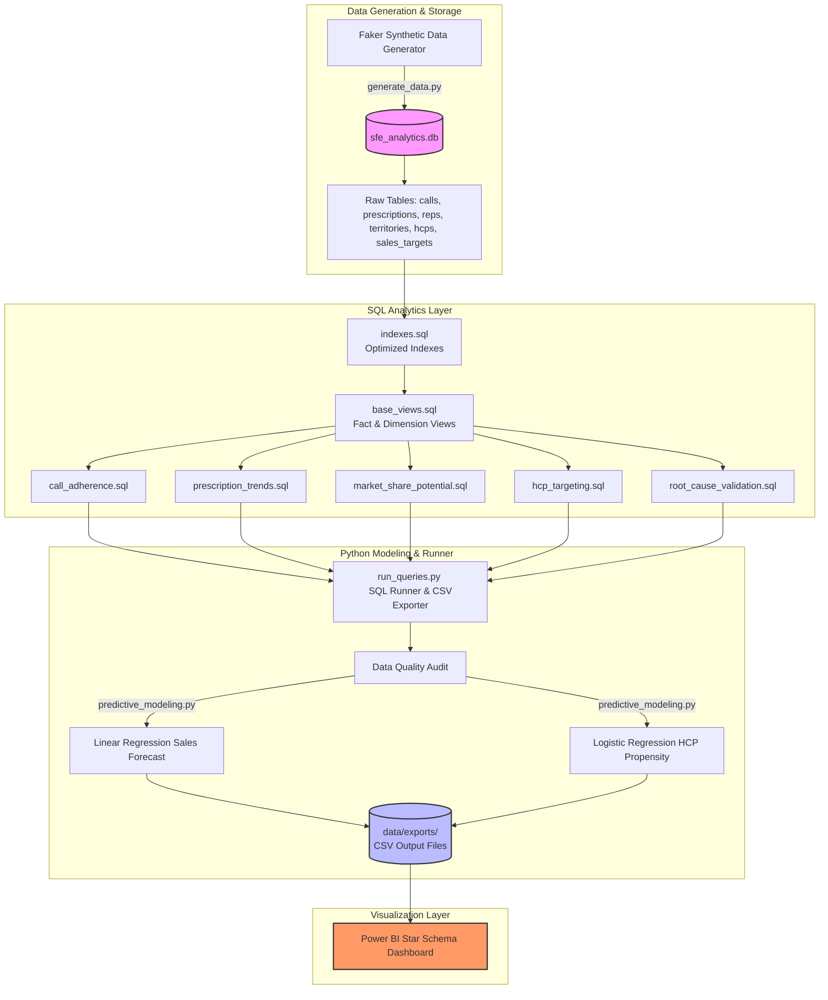

# 📊 Sales Force Effectiveness (SFE) & Market Access Analytics

An end-to-end commercial analytics pipeline designed to help a pharmaceutical company's VP of Sales optimize field force execution, prioritize high-value Healthcare Providers (HCPs), and diagnose territory-level sales performance.

---

## 🔍 Executive Summary & Business Objective
Historically, analyzing territory underperformance, rep execution, and market access issues was a manual, retrospective process taking 1–3 weeks. This project automates the entire process, integrating CRM call logs, prescription claims, and sales targets into a repeatable data pipeline that:
*   **Reduces manual reporting overhead** from weeks to minutes.
*   **Optimizes field resource allocation** using a custom **Territory Potential Index (TPI)**.
*   **Prevents revenue leakage** by identifying high-value, underserved prescribers.
*   **Flags quota risks early** (by mid-quarter) using predictive modeling to trigger manager interventions.
*   **Forecasts future sales** with explainable linear regression models.

---

## 🏗️ End-to-End Pipeline Architecture
The project is structured into three integrated layers:
1.  **Data Ingestion & SQL Layer**: SQLite database modeling a relational database schema with analytical views calculating core commercial KPIs.
2.  **Machine Learning Layer**: Python scripts for data quality audits, linear regression sales forecasting, and logistic regression doctor prescribing growth propensity.
3.  **Visualization Layer**: Interactive Star Schema Power BI Dashboard to track KPIs and model recommendations.

Here is the data flow of the entire system:



---

## 📂 Project Repository Structure
```
c:\Users\Gauravi\Desktop\ba_pro\
├── data/
│   ├── sfe_analytics.db              # Core SQLite database file containing all cleaned tables
│   ├── *.csv                         # Raw data CSV extracts (reps, hcps, territories, etc.)
│   └── exports/                      # Data exported for Power BI ingestion
│       ├── call_adherence.csv        # CRM call activity metrics
│       ├── territory_opportunity.csv  # Territory market share and opportunity gaps
│       ├── underserved_hcps.csv      # Prioritized doctor lists for rep visits
│       ├── prescription_trends.csv   # Prescription sales volumes
│       ├── market_share.csv          # Brand vs Category market share
│       ├── root_cause_summary.csv    # Underperforming region diagnosis
│       ├── territory_forecast.csv    # Projected sales with 95% Confidence Intervals
│       ├── rep_risk_flags.csv        # Rep quota risk classifications (Q4)
│       └── business_recommendations.csv # Actionable, prioritized SFE alerts
├── docs/
│   ├── business_requirements_document.md # Executive business goals and scope
│   ├── stakeholder_requirements.md  # Stakeholder interviews, MoSCoW, and formulas
│   ├── data_dictionary.md            # Schema designs, types, and ER diagram
│   ├── process_mapping.md            # As-Is vs To-Be flows and Root-Cause Tree
│   ├── sql_documentation.md          # SQL view documentation and glossary
│   ├── predictive_modeling_guide.md  # ML validation, metrics, and coefficients
│   └── dashboard_guide.md            # Power BI theme, star schema, and Dax measures
├── scripts/
│   ├── generate_data.py              # Ingests Faker and outputs synthetic dataset
│   ├── run_queries.py                # Pipeline runner for database views
│   └── predictive_modeling.py        # ML training and SFE recommendations script
├── requirements.txt                  # Python dependencies
└── README.md                         # Main documentation
```

---

## 📈 Commercial KPIs & Mathematical Formulations
The SQL layer (`sql/` scripts) computes core sales metrics to drive decision-making:

1.  **Call Plan Adherence %**:
    $$\text{Call Adherence \%} = \left( \frac{\text{Completed Planned Calls}}{\text{Total Planned Calls}} \right) \times 100$$
2.  **Brand Market Share %** (*Apexacare*):
    $$\text{Market Share \%} = \left( \frac{\text{Apexacare TRx}}{\text{Total Market TRx}} \right) \times 100$$
3.  **Share of Voice (SOV) %**:
    $$\text{Share of Voice \%} = \left( \frac{\text{Apexacare Completed Calls}}{\text{Estimated Total Market Calls}} \right) \times 100$$
4.  **Territory Potential Index (TPI)**:
    $$\text{TPI} = (0.50 \times \text{Category Vol Factor}) + (0.30 \times \text{Target HCP Count Factor}) + (0.20 \times \text{Patient Vol Proxy})$$
5.  **Opportunity Gap (USD)**:
    $$\text{Opportunity Gap} = \text{Potential Sales (TPI-driven)} - \text{Actual Sales}$$

---

## 🤖 Predictive Machine Learning Layer
The python ML pipeline (`scripts/predictive_modeling.py`) implements two distinct models:

### 1. Sales Forecasting (Linear Regression)
Predicts next-month territory sales based on time trend (`month_idx`), `lag_1` sales, and a 3-month rolling average.
*   **Validation Methodology**: Rolling window time-series cross-validation (Folds 7–12).
*   **Performance vs. Naïve Baseline**:
    *   Naïve Baseline MAE: **$6,066.69** (5.74% MAPE)
    *   Linear Regression MAE: **$5,143.86** (4.82% MAPE)
    *   *Improvement*: Outperforms baseline by **15.2%**.
*   **Model Equation**:
    $$\text{Forecast} = 161.23 \times \text{month\_idx} + 0.10 \times \text{lag\_1} + 0.86 \times \text{rolling\_3m\_avg} + 2494.39$$

### 2. HCP Prescribing Propensity Model (Logistic Regression)
Classifies if an HCP will increase their prescribing volume of *Apexacare* next month.
*   **Performance (Month 12 Holdout Set)**:
    *   **Accuracy**: 71.57%
    *   **Precision/Recall**: 70.55%
    *   **ROC-AUC**: 76.49%
*   **Key Feature Insights (Odds Ratios)**:
    *   Primary Care Specialities have a **5.0% higher odds** ($e^{\beta} = 1.0496$) of growth MoM.
    *   High Prescribing Decile doctors are **2.0% more likely** ($e^{\beta} = 1.0197$) to grow.

---

## 📊 Power BI Dashboard Setup
The dashboard is designed with a **Star Schema** data model and is styled with a professional corporate theme:
*   **Colors**: Deep Navy (`#1F4E79`), Teal (`#00A6A6`), Emerald Success (`#2ECC71`), Crimson Danger (`#E74C3C`).
*   **Dim Tables**: `Dim_Date`, `Dim_Territories`, `Dim_Reps`, `Dim_HCPs`
*   **Fact Tables**: `Fact_Sales_Targets`, `Fact_Call_Adherence`, `Fact_Market_Share`, `Fact_Territory_Opportunity`, `Fact_Underserved_HCPs`

---

## 🚀 How to Set Up and Run

### 1. Prerequisites
*   Python 3.8+ installed.
*   Power BI Desktop (for visualization).

### 2. Install Dependencies
Run the following in the project root folder:
```powershell
# Create virtual environment
python -m venv venv

# Activate virtual environment (Windows)
.\venv\Scripts\activate

# Install requirements
pip install -r requirements.txt
```

### 3. Run the Data Pipeline
Run the script to generate the synthetic raw dataset and create the SQLite database:
```powershell
python scripts/generate_data.py
```

Run the SQL analytics queries to populate views and export CSV files to `data/exports/`:
```powershell
python scripts/run_queries.py
```

Run the machine learning pipeline to run audits, calculate sales forecasts, identify rep quota risks, and compile SFE business recommendations:
```powershell
python scripts/predictive_modeling.py
```

### 4. Refresh Power BI Dashboard
1.  Open Power BI Desktop.
2.  Load the CSV files from `data/exports/`.
3.  When updating data in the database, re-run `run_queries.py` and `predictive_modeling.py`, then click **Refresh** in Power BI to sync all visuals.

---

## 💡 Actionable Business Recommendations
The ML pipeline generates three distinct files in `data/exports/` which are exported to managers:
1.  **Top Territory Growth Opportunities (`territory_forecast.csv`)**: Identifies high-momentum areas where managers can reallocate local marketing budgets.
2.  **Quota Risk Alerts (`rep_risk_flags.csv`)**: Groups reps into *Low*, *Moderate*, *High*, and *Critical* risk bands for Q4, indicating where managers should perform field ride-alongs.
3.  **High-Value Underserved Doctors (`underserved_hcps.csv`)**: Serves as a target list for reps, highlighting Decile 9 & 10 HCPs with high prescribing propensity scores ($> 70\%$) but below-median visits.
