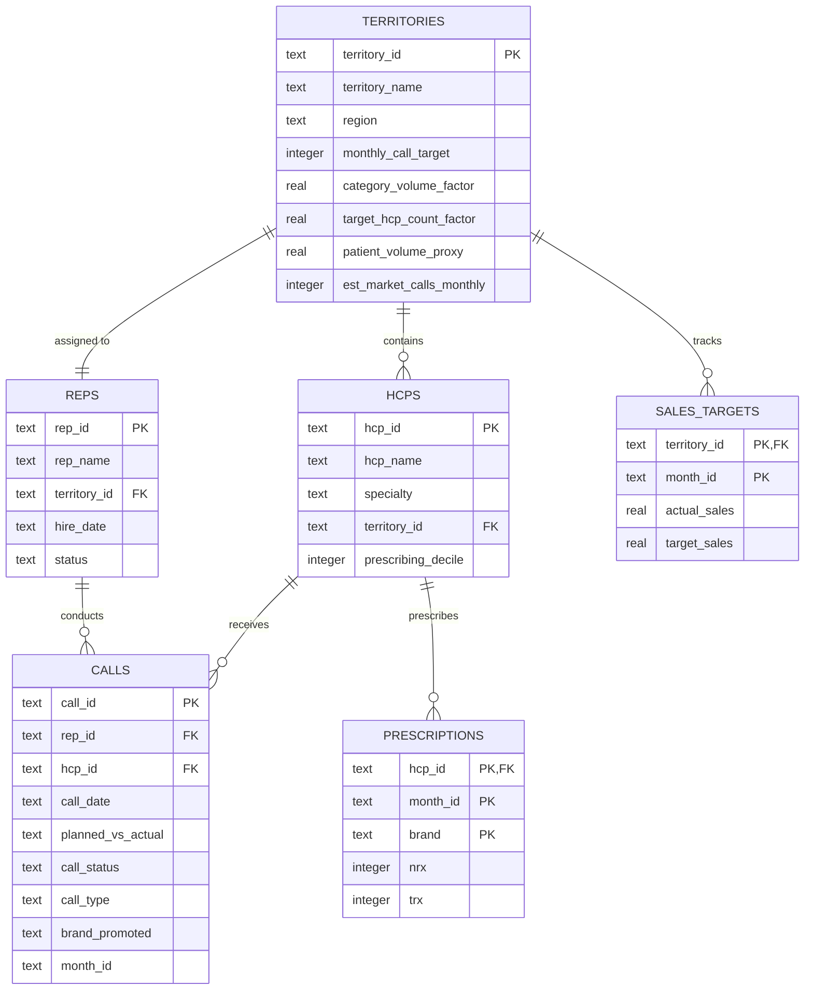

# Data Dictionary & Entity-Relationship Diagram

This document defines the schema, relationships, and business terminology of the **SFE & Market Access Analytics** database (`sfe_analytics.db`).

---

## 1. Entity-Relationship (ER) Diagram

The diagram below shows how the tables are connected. The core relationships are:
*   A **Territory** is assigned to one **Rep** (1-to-1 relationship in this model).
*   A **Territory** contains multiple **HCPs** (1-to-many).
*   A **Rep** makes multiple **Calls** to **HCPs** (1-to-many from Rep to Calls, and 1-to-many from HCP to Calls).
*   An **HCP** has monthly **Prescriptions** (1-to-many).
*   A **Territory** has monthly **Sales & Targets** (1-to-many).

---

## 2. Data Dictionary

### Table: `territories`
Contains metadata for each sales territory.

| Field Name | Data Type | Key | Nullable | Description / Constraints |
| :--- | :--- | :--- | :--- | :--- |
| `territory_id` | TEXT | PK | No | Unique identifier for the territory (e.g., `T01`). |
| `territory_name` | TEXT | - | No | Descriptive name (e.g., `Boston Territory`). |
| `region` | TEXT | - | No | Regional grouping (e.g., `East`, `West`, `Region_X`). |
| `monthly_call_target` | INTEGER | - | No | Number of planned calls a rep in this territory should make monthly. |
| `category_volume_factor` | REAL | - | No | Normalized market size factor (0.0 to 1.0) based on category volume. |
| `target_hcp_count_factor` | REAL | - | No | Normalized factor (0.0 to 1.0) representing count of high-priority HCPs. |
| `patient_volume_proxy` | REAL | - | No | Normalized factor (0.0 to 1.0) representing patient population density. |
| `est_market_calls_monthly` | INTEGER | - | No | Estimated total calls made by all competitors + our brand in this territory. |

### Table: `reps`
Contains information about the sales representatives.

| Field Name | Data Type | Key | Nullable | Description / Constraints |
| :--- | :--- | :--- | :--- | :--- |
| `rep_id` | TEXT | PK | No | Unique identifier for the sales representative (e.g., `R01`). |
| `rep_name` | TEXT | - | No | Full name of the representative. |
| `territory_id` | TEXT | FK | No | References `territories(territory_id)`. |
| `hire_date` | TEXT | - | No | Date of hire in `YYYY-MM-DD` format (used to calculate tenure). |
| `status` | TEXT | - | No | Employment status (e.g., `Active`, `Terminated`). |

### Table: `hcps`
Healthcare Providers (HCPs / Physicians) master table.

| Field Name | Data Type | Key | Nullable | Description / Constraints |
| :--- | :--- | :--- | :--- | :--- |
| `hcp_id` | TEXT | PK | No | Unique identifier for the physician (e.g., `H001`). |
| `hcp_name` | TEXT | - | No | Physician's name (e.g., `Dr. Smith`). |
| `specialty` | TEXT | - | No | Medical specialty (e.g., `Cardiology`, `Endocrinology`, `Primary Care`). |
| `territory_id` | TEXT | FK | No | References `territories(territory_id)`. |
| `prescribing_decile` | INTEGER | - | No | Prescribing volume segment (1 = lowest, 10 = highest). |

### Table: `calls`
Log of sales representative interactions (calls) with physicians.

| Field Name | Data Type | Key | Nullable | Description / Constraints |
| :--- | :--- | :--- | :--- | :--- |
| `call_id` | TEXT | PK | No | Unique identifier for the call (e.g., `C000001`). |
| `rep_id` | TEXT | FK | No | References `reps(rep_id)`. |
| `hcp_id` | TEXT | FK | Yes | References `hcps(hcp_id)`. Can be NULL (simulating CRM sync errors). |
| `call_date` | TEXT | - | Yes | Date of call in `YYYY-MM-DD` format. Can be NULL. |
| `planned_vs_actual` | TEXT | - | No | Status of call scheduling: `Planned` or `Unplanned`. |
| `call_status` | TEXT | - | Yes | Outcome: `Completed`, `No Show`, `Cancelled`. Can be NULL (sync errors). |
| `call_type` | TEXT | - | Yes | Channel: `In-Person`, `Virtual`, `Phone`. |
| `brand_promoted` | TEXT | - | Yes | Product discussed: `Apexacare` or `None`. |
| `month_id` | TEXT | - | No | Year-Month of the call in `YYYY-MM` format (for quick aggregations). |

### Table: `prescriptions`
Monthly prescription counts (claims data) at the physician level.

| Field Name | Data Type | Key | Nullable | Description / Constraints |
| :--- | :--- | :--- | :--- | :--- |
| `hcp_id` | TEXT | PK, FK | No | References `hcps(hcp_id)`. |
| `month_id` | TEXT | PK | No | Year-Month in `YYYY-MM` format. |
| `brand` | TEXT | PK | No | Product brand: `Apexacare`, `Competitor_A`, `Competitor_B`. |
| `nrx` | INTEGER | - | No | New Prescriptions written by the HCP in that month. |
| `trx` | INTEGER | - | No | Total Prescriptions (New + Refills) written in that month. |

### Table: `sales_targets`
Monthly actual sales and quota targets at the territory level.

| Field Name | Data Type | Key | Nullable | Description / Constraints |
| :--- | :--- | :--- | :--- | :--- |
| `territory_id` | TEXT | PK, FK | No | References `territories(territory_id)`. |
| `month_id` | TEXT | PK | No | Year-Month in `YYYY-MM` format. |
| `actual_sales` | REAL | - | No | Actual dollar sales recorded (includes retail Rx + institutional sales). |
| `target_sales` | REAL | - | No | Quota target in dollars set for the territory. |

---

## 3. Business Glossary

Below is a glossary of key pharmaceutical sales metrics and abbreviations used in this project:

*   **HCP (Healthcare Professional)**: A physician or medical provider targeted by sales representatives for detailing.
*   **NRx (New Prescriptions)**: The count of new prescriptions written by an HCP for a brand in a given month. It represents the brand's ability to acquire new patients.
*   **TRx (Total Prescriptions)**: The sum of all prescriptions (New + Refills) written by an HCP. It represents the total volume of the brand.
*   **SOV (Share of Voice)**: The percentage of sales rep calls promoting our brand (*Apexacare*) compared to the total estimated category calls in a territory.
    $$\text{SOV} = \frac{\text{Apexacare Calls}}{\text{Estimated Market Calls}} \times 100$$
*   **TPI (Territory Potential Index)**: A weighted index representing the sales potential of a territory, calculated from category volume, target HCP counts, and patient density.
*   **Opportunity Gap**: The difference between a territory's estimated potential sales and its actual sales, indicating underperforming areas.
    $$\text{Opportunity Gap} = \text{Potential Sales} - \text{Actual Sales}$$
*   **Call Adherence %**: The percentage of planned calls that were successfully completed.
    $$\text{Call Adherence} = \frac{\text{Completed Planned Calls}}{\text{Total Planned Calls}} \times 100$$
*   **Sales Target Attainment %**: The percentage of the sales quota achieved by a territory or rep.
    $$\text{Attainment} = \frac{\text{Actual Sales}}{\text{Target Sales}} \times 100$$
