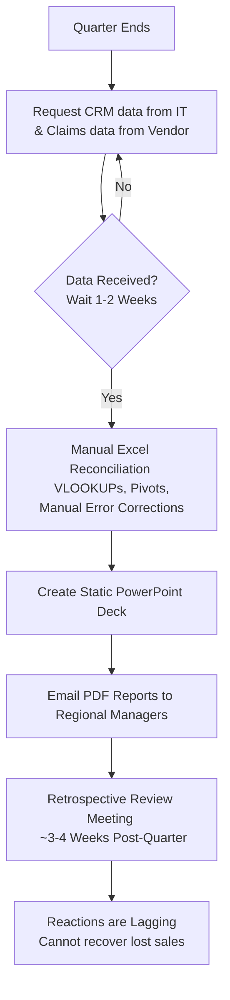
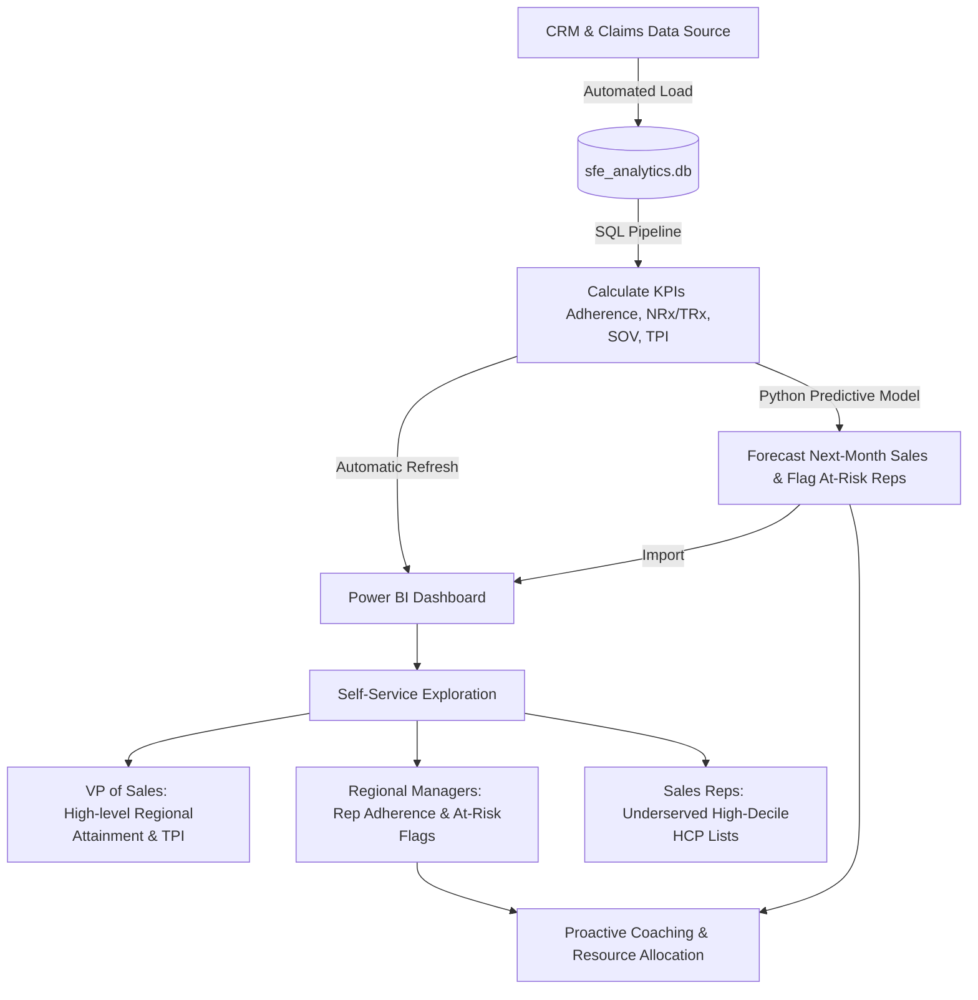
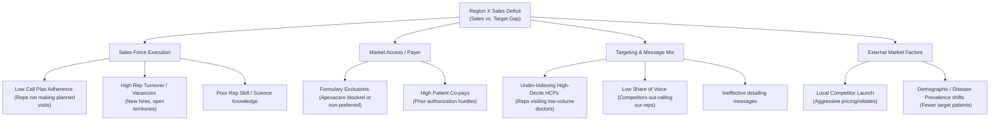

# Process Mapping & Root-Cause Analysis

This document outlines the business process improvement from the current manual reporting method to our automated analytics solution, and defines the diagnostic framework for analyzing Region X's underperformance.

---

## 1. As-Is Process Map (Current State)

Currently, territory performance reviews are retrospective, manual, and slow. The process takes several weeks, meaning insights are acted upon when they are already outdated.

---

## 2. To-Be Process Map (Future State)

The future state automates the data ingestion and transformation, providing daily/weekly self-service dashboard access, drill-down capabilities, and predictive risk alerts.

---

## 3. Root-Cause Issue Tree: Why is Region X Underperforming?

To diagnose the sales deficit in Region X, we structure our hypotheses into four primary branches. The SQL queries in Phase 2 and the dashboard in Phase 3 will validate which of these branches are the true drivers.

Work in Phase 2 will focus on using SQL queries to test these hypotheses, specifically comparing Region X's **Call Adherence (B1_1)**, **Rep Tenure (B1_2)**, **Share of Voice (B3_2)**, and **HCP Coverage (B3_1)** against other regions.
