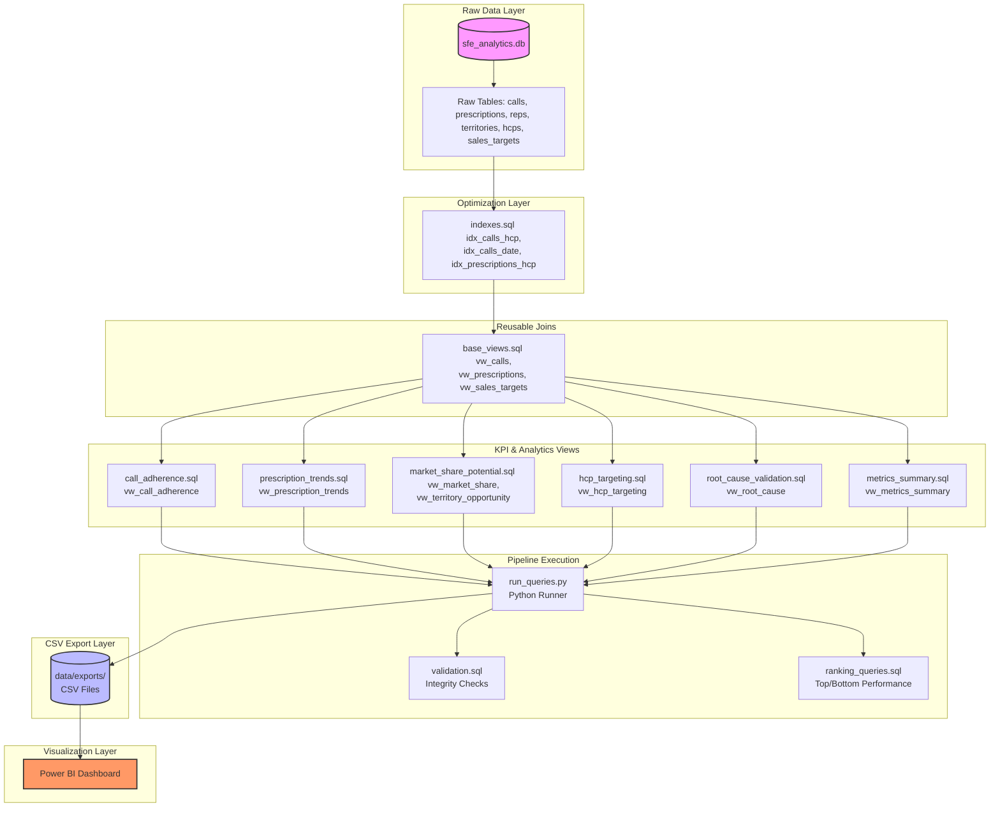

# SQL Analytics Layer & KPI Documentation

This document describes the design, architecture, and business logic of the SQL analytics layer built on top of the SFE database.

---

## 1. Analytics Architecture Diagram

The data flow from raw CRM and claims tables to the final Power BI dashboard is structured as follows:

---

## 2. Business Glossary

| Term | Full Name | Business Definition |
| :--- | :--- | :--- |
| **HCP** | Healthcare Professional | A licensed physician, nurse practitioner, or physician assistant eligible to prescribe medications. |
| **NRx** | New Prescriptions | The count of new, first-time prescriptions written by an HCP for a specific brand in a given month. |
| **TRx** | Total Prescriptions | The sum of New Prescriptions (NRx) and Refill Prescriptions written by an HCP. Represents total brand volume. |
| **SOV** | Share of Voice | The percentage of promotional activity (sales calls) received by our brand relative to the total category activity. |
| **TPI** | Territory Potential Index | A composite score (0-100) representing a territory's sales opportunity based on market volume, target HCPs, and patient density. |
| **Opportunity Gap** | Territory Opportunity Gap | The difference between a territory's estimated sales potential (based on TPI) and its actual sales. Highlights under-indexing. |
| **Call Adherence** | Call Plan Adherence % | The percentage of planned doctor visits that a sales representative successfully completed. |

---

## 3. KPI Reference Manual

### 1. Call Plan Adherence & Execution
*   **Business Question**: How effectively are our reps executing their monthly call plans, and what are the primary drivers of missed visits (cancellations vs. doctor no-shows)?
*   **Mathematical Formula**:
    $$\text{Call Adherence \%} = \left( \frac{\text{Completed Planned Calls}}{\text{Total Planned Calls}} \right) \times 100$$
    $$\text{No-Show Rate \%} = \left( \frac{\text{No Show Calls}}{\text{Total Planned Calls}} \right) \times 100$$
    $$\text{Cancellation Rate \%} = \left( \frac{\text{Cancelled Calls}}{\text{Total Planned Calls}} \right) \times 100$$
*   **SQL View**: [vw_call_adherence](file:///c:/Users/Gauravi/Desktop/ba_pro/sql/call_adherence.sql)
*   **Output Columns**: `planned_calls`, `completed_planned_calls`, `total_completed_calls`, `missed_calls`, `adherence_pct`, `completion_rate`, `no_show_rate`, `cancellation_rate`.
*   **Intended Dashboard Visual**: Monthly line chart showing Adherence % and Completion Rate % alongside stacked bar charts of call statuses (Completed, No Show, Cancelled).

### 2. Market Share & Share of Voice (SOV)
*   **Business Question**: What is our brand's market share in each territory, how does it relate to our Share of Voice, and are we gaining or losing share month-over-month?
*   **Mathematical Formula**:
    $$\text{Brand Market Share \%} = \left( \frac{\text{Apexacare TRx}}{\text{Total Market TRx}} \right) \times 100$$
    $$\text{Share of Voice \%} = \left( \frac{\text{Apexacare Completed Calls}}{\text{Estimated Total Market Calls}} \right) \times 100$$
    $$\text{Share Gain/Loss} = \text{Market Share \%}_{\text{Current}} - \text{Market Share \%}_{\text{Prior}}$$
*   **SQL View**: [vw_market_share](file:///c:/Users/Gauravi/Desktop/ba_pro/sql/market_share_potential.sql)
*   **Output Columns**: `apex_trx`, `total_market_trx`, `completed_apex_calls`, `est_market_calls_monthly`, `share_of_voice_pct`, `brand_market_share_pct`, `sales_growth_pct`, `category_growth_pct`, `share_gain_loss`.
*   **Intended Dashboard Visual**: Scatter plot mapping Share of Voice % (X-axis) against Brand Market Share % (Y-axis), with bubbles sized by territory sales.

### 3. Territory Potential & Opportunity Gap
*   **Business Question**: Which territories have the highest untapped sales potential, and how should we prioritize them for resource reallocation?
*   **Mathematical Formula**:
    $$\text{TPI} = (0.50 \times \text{Category Volume Factor}) + (0.30 \times \text{Target HCP Count Factor}) + (0.20 \times \text{Patient Volume Proxy})$$
    $$\text{Potential Sales (USD)} = \text{TPI Score} \times \$800$$
    $$\text{Opportunity Gap (USD)} = \text{Potential Sales} - \text{Actual Sales}$$
*   **SQL View**: [vw_territory_opportunity](file:///c:/Users/Gauravi/Desktop/ba_pro/sql/market_share_potential.sql)
*   **Output Columns**: `tpi_score`, `potential_sales`, `actual_sales`, `target_sales`, `opportunity_gap`, `opportunity_rank`, `priority_band` (`Critical`, `High`, `Medium`, `Low`).
*   **Intended Dashboard Visual**: A ranked horizontal bar chart of territories by Opportunity Gap, color-coded by priority band.

### 4. Actionable HCP Targeting
*   **Business Question**: Which high-prescribing physicians (deciles 9-10) are being underserved by our field force, and what is the estimated revenue loss associated with this neglect?
*   **Mathematical Formula**:
    $$\text{HCP Brand Share \%} = \left( \frac{\text{HCP Apexacare TRx}}{\text{HCP Total Category TRx}} \right) \times 100$$
    $$\text{Estimated Lost TRx} = \max\left(0, \frac{\text{Regional Avg Share \%} - \text{HCP Brand Share \%}}{100} \times \text{HCP Total Category TRx}\right)$$
    $$\text{Potential Lost Revenue (USD)} = \text{Estimated Lost TRx} \times \$150$$
*   **SQL View**: [vw_hcp_targeting](file:///c:/Users/Gauravi/Desktop/ba_pro/sql/hcp_targeting.sql)
*   **Output Columns**: `hcp_name`, `specialty`, `prescribing_decile`, `completed_calls_count`, `territory_median_calls`, `days_since_last_visit`, `est_lost_trx`, `potential_lost_revenue`, `suggested_calls_next_month`.
*   **Intended Dashboard Visual**: Grid table with conditional formatting on `potential_lost_revenue` and `days_since_last_visit` to serve as a call list for reps.

### 5. Regional Root-Cause Diagnostics
*   **Business Question**: Why is Region X underperforming, and is the deficit driven by sales force execution, market access exclusions, or targeting issues?
*   **SQL View**: [vw_root_cause](file:///c:/Users/Gauravi/Desktop/ba_pro/sql/root_cause_validation.sql)
*   **Output Columns**: `region`, `total_actual_sales`, `total_target_sales`, `sales_attainment_pct`, `call_adherence_pct`, `share_of_voice_pct`, `market_share_pct`, `avg_rep_tenure_days`, `hcp_coverage_gap_pct`, `regional_opportunity_gap`.
*   **Intended Dashboard Visual**: Side-by-side executive comparison table with red/green KPI cards comparing Region X against the top-performing region.
